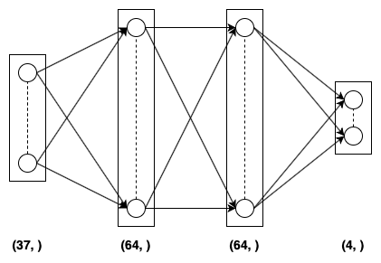
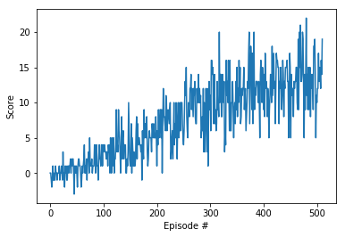

# Banana Collecting Agent

This project is part of <b>Udacity's Deep Reinforcement Learning Nanodegree</b>

## Description

<p>The project involves an agent that is tasked to collect as much yellow bananas as possible ignoring the blue bananas. The environment is created using Unity and can be found in Unity ML Agents. On collecting a yellow banana the agent gets a reward of <b>+1</b> and on collecting a blue banana the agnet is given a reward (or punishment) of <b>-1</b>.</p>

<p>The state space has <b>37</b> dimensions and the agent can perform <b>4</b> different actions:<br><br>
  <b>0</b> - move forward <br><br>
  <b>1</b> - move backward <br><br>
  <b>2</b> - turn left <br><br>
  <b>3</b> - turn right <br><br>
</p>

<p>The agent's task is episodic and is solved when the agent gets atleast <b>+13</b> over consecutive <b>100</b> episodes.</p>

<p>For this task I used a Deep Q Network which takes as input the current 37 dimensional state and passed through <b>two (2)</b> layers of multi layered perceptron with <b>ReLU</b> activation followed by an output layer which gives the action-values for all the possible actions.</p>

## Steps to run

<ol>
  <li>Clone the repository:<br><br>
  
  ```console
  user@programer:~$ git clone https://github.com/frankhart2018/banana-collecting-agent
  ```
  
  </li>
  <li>Install the requirements:<br><br>
  
  ```console
  user@programmer:~$ pip install requirements.txt
  ```
  
  </li>
  <li>Download your OS specific unity environment:
    <ul>
      <li>Linux: <a href='https://s3-us-west-1.amazonaws.com/udacity-drlnd/P1/Banana/Banana_Linux.zip'>click here</a></li><br>
      <li>MacOS: (well I have already put the macOS version :relieved:, but in case you still want to download then here is the link :grin:): <a href='https://s3-us-west-1.amazonaws.com/udacity-drlnd/P1/Banana/Banana.app.zip'>click here</a></li><br>
      <li>Windows (32 bit): <a href='https://s3-us-west-1.amazonaws.com/udacity-drlnd/P1/Banana/Banana_Windows_x86.zip'>click here</a></li><br>
      <li>Windows (64 bit): <a href='https://s3-us-west-1.amazonaws.com/udacity-drlnd/P1/Banana/Banana_Windows_x86_64.zip'>click here </a></li><br>
    </ul>
  </li>
  
  <li>Unzip the downloaded environment file</li><br>
  <li>If you prefer using jupyter notebook then launch the jupyter notebook instance:<br><br>
  
  ```console
  user@programmer:~$ jupyter-notebook
  ```
  
  :arrow_right: For re-training the agent use <b>Banana Collecting Agent.ipynb</b><br><br>
  :arrow_right: For testing the agent use <b>Banana Agent Tester.ipynb</b><br><br>
  
  In case you like to run a python script use:<br>
  
  :arrow_right: For re-training the agent type:<br>
  
  ```console
  user@programmer:~$ python train.py
  ```
  
  :arrow_right: For testing the agent use:<br>
  
  ```console
  user@programmer:~$ python test.py
  ```
  
  </li>
</ol>

## Technologies used

<ol>
  <li>Unity ML Agents</li>
  <li>PyTorch</li>
  <li>NumPy</li>
  <li>Matplotlib</li>
</ol>

## Algorithms used

<ol>
  <li>Multi Layered Perceptron.</li>
  <li>Deep Q-Network. To learn more about this algorithm you can read the original paper by <b>DeepMind</b>: <a href='https://web.stanford.edu/class/psych209/Readings/MnihEtAlHassibis15NatureControlDeepRL.pdf'>Human-level control through deep reinforcement learning</a></li>
</ol>

## Model description

<p>The Q-Network has three dense (or fully connected layers). The first two layers have <b>64</b> nodes activated with <b>ReLU</b> activation function. The final (output layer) has <b>4</b> nodes and is activated with linear activation (or no activation at all). This network takes in as input the <b>37</b> dimensional current state and gives as output <b>4</b> action-values corresponding to the possible actions that the agent can take.</p>

<p>The neural network used Adam optimizer and Mean Squared Error (MSE) as the loss function.</p>

<p>The following image provides a pictorial representation of the Q-Network model:</p>

<p align='center'>
  
</p>

<p>The following image provides the plot for score v/s episode number:</p>

<p align='center'>
  
</p>

## Hyperparameters used

| Hyperparameter           | Value  | Description                                               |
|--------------------------|--------|-----------------------------------------------------------|
| Buffer size              | 100000 | Maximum size of the replay buffer                         |
| Batch size               | 64     | Batch size for sampling from replay buffer                |
| Gamma ($\gamma$)         | 0.99   | Discount factor for calculating return                    |
| Tau ($\tau$)             | 0.001  | Hyperparameter for soft update of target parameters       |
| Learning Rate ($\alpha$) | 0.0005 | Learning rate for the neural networks                     |
| Update Every (C)         | 4      | Number of time steps after which soft update is performed |
| Epsilon ($\epsilon$)     | 1.0    | For epsilon-greedy action selection                       |
| Epsilon decay rate       | 0.995  | Rate by which epsilon decays after every episode          |
| Epsilon minimum          | 0.01   | The minimum value of epsilon                              |
