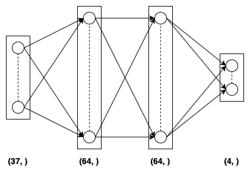

# Report of training the agent

The model was trained for a maximum of 2,000 episodes but the agent was able to solve the environment (i.e. get atleast +13 average score over 100 adjacent episodes).

## Model

The model is called a Deep Q-Network which was first discovered by the DeepMind team. This uses a Deep Neural Network (or a Multi Layered Perceptron) for estimating the action-value function (Qπ).

The Q-Network has three dense (or fully connected layers). The first two layers have <b>64</b> nodes activated with <b>ReLU</b> activation function. The final (output layer) has <b>4</b> nodes and is activated with linear activation (or no activation at all). This network takes in as input the <b>37</b> dimensional current state and gives as output <b>4</b> action-values corresponding to the possible actions that the agent can take.

The neural network used Adam optimizer and Mean Squared Error (MSE) as the loss function.

The following image provides a pictorial representation of the Q-Network model:

  

The following image provides the plot for score v/s episode number:

  

## Hyperparameters used

| Hyperparameter           | Value  | Description                                               |
|--------------------------|--------|-----------------------------------------------------------|
| Buffer size              | 100000 | Maximum size of the replay buffer                         |
| Batch size               | 64     | Batch size for sampling from replay buffer                |
| Gamma (<b>γ</b>)         | 0.99   | Discount factor for calculating return                    |
| Tau (<b>τ</b>)           | 0.001  | Hyperparameter for soft update of target parameters       |
| Learning Rate (<b>α</b>) | 0.0005 | Learning rate for the neural networks                     |
| Update Every (<b>C</b>)  | 4      | Number of time steps after which soft update is performed |
| Epsilon (<b>ε</b>)       | 1.0    | For epsilon-greedy action selection                       |
| Epsilon decay rate       | 0.995  | Rate by which epsilon decays after every episode          |
| Epsilon minimum          | 0.01   | The minimum value of epsilon                              |

## Future work

The following algorithms can be considered for further development of this agent:

<ul>
  <li>Double DQN</li>
  <li>Duelling DQN</li>
  <li>Prioritized Experience Replay DQN</li>
  <li>Rainbow</li>
</ul>
